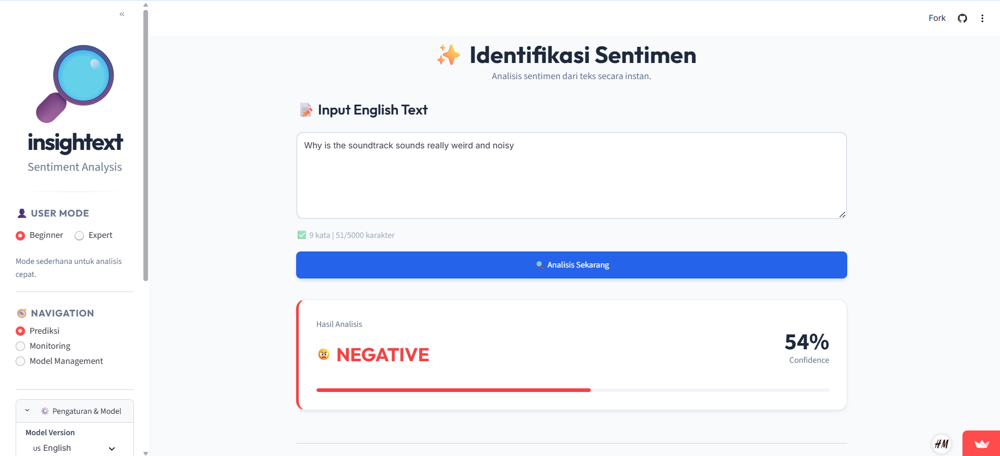

# 🚀 Sentiment Analysis MLOps Pipeline: Continuous Learning System

Sistem Klasifikasi Sentimen End-to-End yang "Hidup": Mampu memprediksi, menerima umpan balik pengguna, memantau performa, dan melakukan pelatihan ulang (Retraining) secara mandiri.

## 📖 Latar Belakang Masalah

Model Machine Learning tradisional bersifat statis. Setelah di-deploy, performanya sering kali menurun seiring waktu karena perubahan tren bahasa atau konteks data (Data Drift). Proyek ini menyelesaikan masalah tersebut dengan pendekatan Closed-Loop MLOps, di mana model terus belajar dari interaksi pengguna.

## 🏗️ Arsitektur Sistem (The Big Picture)

Bagian ini menjelaskan arsitektur sistem secara menyeluruh dalam mengintegrasikan pengguna, layanan prediksi berbasis model machine learning, serta database untuk mendukung proses inferensi, pencatatan log, dan pembaruan model secara real-time.
<!--
🔴 [INSTRUKSI UNTUK VISUALISASI - GAMBAR 1]
Ganti gambar placeholder di bawah ini dengan diagram arsitektur buatan Anda.
Gunakan tools seperti Excalidraw atau Draw.io.
Pastikan diagram memuat:

User

Streamlit App (Frontend)

Prediction Service (Backend)

Supabase (Database & Logs)
-->

**Komponen Utama:**

- Frontend (Streamlit): Antarmuka interaktif untuk pengguna melakukan prediksi sentimen dan memberikan feedback.
- Prediction Service: Layanan backend yang memuat model .pkl dan menangani logika inferensi.
- Feedback Loop: Mekanisme "Human-in-the-loop" yang memungkinkan pengguna mengoreksi prediksi model yang salah.
- Supabase Cloud: Database PostgreSQL untuk menyimpan log prediksi, feedback pengguna, dan metadata model.
- Automated Retraining: Layanan yang dipicu kondisi tertentu untuk melatih ulang model menggunakan data terbaru.

## 🔄 Siklus Hidup MLOps (Operational Workflow)

Diagram di bawah ini menjelaskan alur operasional sistem ("The Brain of MLOps"), mulai dari prediksi hingga pembaruan model otomatis.

```mermaid
graph TD
    %% Alur utama dari input pengguna sampai hasil
    UserInput[User Input Text]
    ValidateInput{Validasi Input}
    ClickAnalyze[Klik Analisis]
    LoadModel[Load Model Aktif]
    Inference[Preprocessing dan Inference]
    Confidence[Hitung Confidence]
    Consent{User Consent}
    Anonymize[Anonymize Data]
    Database[(Supabase Database)]
    ShowResult[Tampilkan Hasil]
    History[Riwayat Prediksi]

    %% Alur MLOps
    Monitor[Monitoring Performa]
    Drift[Deteksi Drift]
    RetrainTrigger{Trigger Retraining}
    FetchData[Ambil Data Terbaru]
    SplitData[Split Train dan Test]
    TrainModel[Train Model Baru]
    Evaluate[Evaluasi Model]
    ValidateModel[Validasi Model]
    ArchiveModel[Archive Model Lama]
    DeployModel[Deploy Model Baru]

    %% Flow utama
    UserInput --> ValidateInput
    ValidateInput -- Valid --> ClickAnalyze
    ValidateInput -- Tidak Valid --> UserInput
    ClickAnalyze --> LoadModel
    LoadModel --> Inference
    Inference --> Confidence
    Confidence --> Consent

    %% Logging dan tampilan
    Consent -- Ya --> Anonymize
    Anonymize --> Database
    Consent -- Tidak --> ShowResult
    Database --> ShowResult
    ShowResult --> History

    %% Flow MLOps
    Database --> Monitor
    Monitor --> Drift
    Drift --> RetrainTrigger
    RetrainTrigger -- Ya --> FetchData
    FetchData --> SplitData
    SplitData --> TrainModel
    TrainModel --> Evaluate
    Evaluate --> ValidateModel
    ValidateModel --> ArchiveModel
    ArchiveModel --> DeployModel
    DeployModel --> LoadModel
````

**Penjelasan Alur:**

- Inference: Model melayani permintaan prediksi dari pengguna.
- Feedback Collection: Jika prediksi salah, pengguna memberikan koreksi yang langsung disimpan ke database.
- Monitoring: Sistem secara berkala mengecek performa model berdasarkan data feedback terbaru.
- Retraining: Jika akurasi turun di bawah ambang batas atau data baru sudah cukup banyak, retraining_service.py akan dijalankan untuk menghasilkan model baru yang lebih pintar.

## 📸 Fitur & Demo Aplikasi

1. Prediksi & Koreksi (Active Learning)

Antarmuka pengguna dirancang untuk mempermudah validasi hasil model.



Halaman utama menampilkan antarmuka analisis sentimen yang sederhana dan intuitif. Pengguna dapat memasukkan teks ulasan (minimal 7 kata), kemudian sistem akan menampilkan hasil prediksi sentimen (Positif/NegatifNetral) beserta tingkat confidence. Aplikasi juga menyediakan tombol contoh teks untuk demonstrasi cepat dan menampilkan riwayat prediksi terakhir untuk referensi.

<!--
🔴 [INSTRUKSI UNTUK VISUALISASI - GAMBAR 2]
Masukkan Screenshot Halaman Utama (Main Area) di sini.
Pastikan terlihat: Input teks, Hasil Prediksi, dan Tombol Feedback "Benar/Salah".
-->

2. Monitoring Dashboard

Admin dapat memantau kesehatan model secara transparan melalui grafik real-time.


Dashboard monitoring menampilkan metrik utama seperti Total Prediksi, Rata-rata Latency, dan Drift Score Global. Sistem juga menampilkan deteksi data drift yang membantu mengidentifikasi kapan model perlu di-retrain berdasarkan perubahan distribusi data.


Halaman monitoring juga menampilkan tabel evaluasi model yang membandingkan akurasi dan F1 Score antar versi model, serta grafik frekuensi prediksi per versi model untuk analisis penggunaan.


Dashboard juga menyediakan visualisasi distribusi latency melalui histogram yang menampilkan sebaran waktu respons prediksi. Grafik ini dilengkapi dengan threshold untuk mengidentifikasi prediksi yang melebihi batas waktu yang ditentukan, serta statistik lengkap seperti nilai minimum, rata-rata, maksimum, dan jumlah prediksi di atas threshold.

## 🛠️ Teknologi (Tech Stack)

| Kategori      | Teknologi             | Kegunaan Utama                         |
| ------------- | --------------------- | -------------------------------------- |
| Frontend      | Streamlit             | UI Interaktif & Visualisasi Data       |
| Backend Logic | Python 3.9+           | Core Services (Prediction, Retraining) |
| ML Framework  | Scikit-learn          | Naive Bayes, TF-IDF, Pipeline          |
| Database      | Supabase (PostgreSQL) | Menyimpan Dataset & Feedback Log       |
| Environment   | Docker / DevContainer | Isolasi Environment & Reproducibility  |
| Testing       | Pytest                | Unit Testing & Integration Testing     |

## 🚀 Cara Menjalankan (Quick Start)

Ikuti langkah-langkah berikut untuk menjalankan sistem ini di mesin lokal Anda.

**Prasyarat**

- Python 3.9 atau lebih baru.
- Akun Supabase (Gratis) untuk database.

1. Clone Repository

```bash
git clone https://github.com/username/mlops-sentiment-project.git
cd mlops-sentiment-project
```

2. Konfigurasi Environment

Salin file contoh .env dan isi kredensial Supabase Anda.

```bash
cp .env.example .env
# Edit file .env dan isi SUPABASE_URL serta SUPABASE_KEY
```

3. Setup Database

Buka dashboard Supabase Anda, masuk ke SQL Editor, dan jalankan script yang ada di file:
`database/schema.sql`

4. Install Dependencies

```bash
pip install -r requirements.txt
```

5. Jalankan Aplikasi

```bash
streamlit run app.py
```

## 📂 Struktur Proyek

Kode diorganisir berdasarkan prinsip Separation of Concerns untuk skalabilitas.

```
mlops-project/
├── 📂 services/           # LOGIKA BISNIS UTAMA
│   ├── prediction_service.py   # Menangani inferensi model
│   ├── monitoring_service.py   # Menghitung metrik performa real-time
│   └── retraining_service.py   # Logika pelatihan ulang otomatis
├── 📂 models/             # MODEL REGISTRY
│   ├── saved_model/            # Direktori model aktif (.pkl)
│   └── model_updater.py        # Script aman untuk mengganti model
├── 📂 ui/                 # FRONTEND (STREAMLIT)
│   ├── main_area.py            # Komponen halaman prediksi
│   └── monitoring.py           # Komponen dashboard monitoring
├── 📂 database/           # DATA LAYER
│   └── db_manager_supabase.py  # Koneksi & query ke Supabase
└── app.py                 # Entry point aplikasi
```

## 🧪 Testing

Proyek ini mencakup automated testing untuk memastikan integritas sistem sebelum deployment.

**Menjalankan seluruh test suite**

```bash
pytest
```

**Menjalankan test spesifik**

```bash
pytest tests/test_services/
```

<p align="center">
Dibuat dengan ❤️ untuk Tugas Besar MLOps
</p>
```
